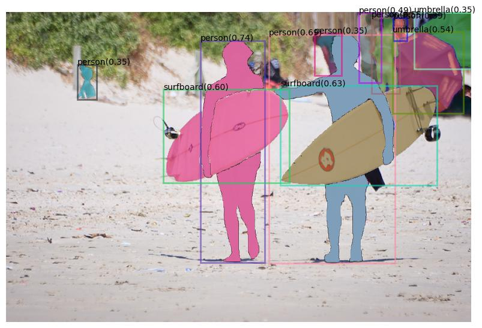

# Label-Anything-Pipeline
> **[Label-Anything-Pipeline](https://github.com/Yuqifan1117/Labal-Anything-Pipeline)**  
> Qifan Yu, Juncheng Li, Siliang Tang, and Yueting Zhuang 

> Zhejiang Univerisity

**This project is under construction and we will have all the code ready soon.**

**GPT-4** can do anything even in visual tasks——Label anything just all in one-pipeline.

## NEWs
**We release our [technical report](https://arxiv.org/abs/2305.12799)**(<span style="color:red">🔥NEW</span>)


**We train the ChatGPT with low-cost and can generate semantically rich prompts for AIGC models creating fantastic images.**

|  Concept / Idea Words   | ChatGPT Prompt Template | AIGC Generated Image | VLM Generated Captions | VFM Automantic Annotations |
|  ----  | ----  | ----  | ----  | ----  |
| Nordic-style decoration room | I want to use artificial intelligence to synthesize the {*Nordic-style decoration room*}. Please describe the features of the {*Nordic-style decoration room*} briefly in English  | | a rendering of a living room with a couch, table, chairs, and a window. | 

Automantic Prompts for AIGC models:
- A room with Nordic-style decoration typically features a clean and minimalist design, with a focus on functionality and simplicity. The color scheme is often light and muted, with shades of white, beige, and gray dominating the palette, creating a sense of calm and tranquility. The furniture is typically made of light-colored wood, with clean lines and simple shapes, and may include iconic Nordic pieces such as a Wegner chair or a Poul Henningsen lamp. Decorative items such as cozy blankets, natural materials like wool or fur, or plants add a touch of warmth and texture to the room. Lighting is often used to create a soft and inviting atmosphere, with natural light streaming in through large windows or artificial light provided by Nordic-inspired fixtures. Overall, a room with Nordic-style decoration creates a sense of simplicity, harmony, and coziness, with a focus on comfort and functionality.

**We teach ChatGPT as an assistant to help us imagine various scenes with different backgrounds based on the simple sentence 'A white dog sits on wooden bench.' and generate much data for down-stream tasks by the help of AIGC models.**(<span style="color:red">🔥NEW</span>)
|  Scene Background | Object Label Words | High-quality Description | Generated Image with Complex Scenes |
|  ----  | ----  | ----  | ----  |
| 'city street' | ['buildings', 'sidewalk', 'streetlights', 'cars', 'trash cans'] | 'A dog sits on a wooden bench on a bustling city street, surrounded by towering buildings and a busy sidewalk. Streetlights illuminate the scene as cars whiz by, and a few trash cans sit nearby. Despite the urban chaos, the dog seems content to watch the world go by.' | 
| 'park' | ['trees', 'grass', 'flowers', 'pond', 'picnic table'] | 'A friendly dog sits on a wooden bench in a peaceful park, surrounded by tall trees and lush green grass. Colorful flowers bloom nearby, and a tranquil pond glistens in the distance. A nearby picnic table invites visitors to relax and enjoy the serene surroundings.' | 
| 'beach' | ['ocean', 'sand', 'umbrella', 'seashells', 'waves'] | 'A dog sits on a wooden bench on a sunny beach, surrounded by soft sand and sparkling blue ocean. A colorful umbrella provides shade, and a few seashells are scattered nearby. The gentle sound of waves lapping at the shore creates a soothing soundtrack for the idyllic scene.' | 

Using stable diffusion to generate and annotate bounding boxes and masks for object detection and segmentation just in one-pipeline! 

**LLM is a data specialist based on AIGC models.**  
1. ChatGPT acts as an educator to guide AIGC models to generate a variety of controllable images in various scenarios
2. Generally, given a raw image from the website or AIGC, SAM generated the masked region for source image and GroundingDINO generated the open-set detection results just in one step. Then, we filter overlap bounding boxes and obtain non-ambiguity annotations.
3. Mixture text prompt and clip model to select the region by similaity scores, which can be finally used to generate the target edited image with stable-diffusion-inpaint pipeline.

## Features
- Highlight features:
  - Pretrained ControlNet with SAM mask as condition enables the image generation with fine-grained control.
  - category-unrelated SAM mask enables more forms of editing and generation.
  - ChatGPT self-chatting enables text guidance-free control for magic image generation in various scenarios.
  - **high-resolution images and high-quality annotations effectively enhance large-scale datasets**.

## Run Demos
- download visual foundation models
```bash
wget https://dl.fbaipublicfiles.com/segment_anything/sam_vit_h_4b8939.pth
wget https://github.com/IDEA-Research/GroundingDINO/releases/download/v0.1.0-alpha2/groundingdino_swinb_cogcoor.pth
```
- initialize the label anything pipeline 
```bash
bash annotation.sh
```
- load AIGC models for generation in edit pipeline and initialize the controllable editing
```bash
bash conditional_edit.sh
```
## Generated Cases
### Fantastic Control-Generation by ChatGPT


- **label word:** 

person, beach, surfboard

- **High quality description prompt automatically generated:**

A couple enjoys a relaxing day at the beach with the man walking together with the woman, holding a big surfboard.  The serene scene is complete with the sound of waves and the warm sun and there are many people lying on the beach. 

- **Generated images in magic scenarios:**


  - Specific category of object in an image~(only given 'human face')
  
  
  
  - Total annotations with category sets
  
  

## :bookmark_tabs: Catelog
- [x] ChatGPT chat for AIGC model
- [x] Label segmentation masks and detection bounding boxes
- [x] Annotate segmentation and detection for Conditional Diffusion Demo 
- [x] Using Grounding DINO and Segment Anything for category-specific labelling.
- [ ] Interactive control on different masks for existing image editing and generated image editing.
- [ ] ChatGPT guided Controllable Image Editing.


# Reference 

[1] https://chat.openai.com/

[2] https://github.com/huggingface/diffusers 

[3] https://github.com/facebookresearch/segment-anything

[4] https://github.com/IDEA-Research/Grounded-Segment-Anything/

## 📜 Citation
If you find this work useful for your research, please cite our paper and star our git repo:
```bibtex
@misc{yu2023interactive,
      title={Interactive Data Synthesis for Systematic Vision Adaptation via LLMs-AIGCs Collaboration}, 
      author={Qifan Yu and Juncheng Li and Wentao Ye and Siliang Tang and Yueting Zhuang},
      year={2023},
      eprint={2305.12799},
      archivePrefix={arXiv},
      primaryClass={cs.CV}
}
```
